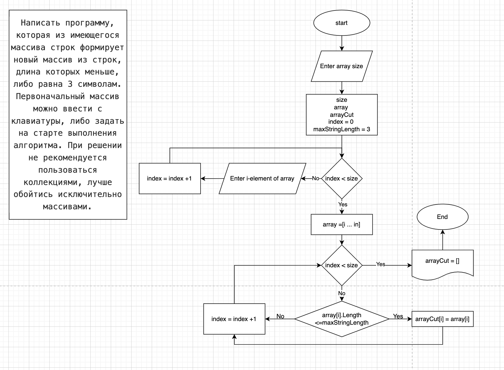

**Задача:**
Написать программу, которая из имеющегося массива строк формирует новый массив из строк, длина которых меньше, либо равна 3 символам. Первоначальный массив можно ввести с клавиатуры, либо задать на старте выполнения алгоритма. При решении не рекомендуется пользоваться коллекциями, лучше обойтись исключительно массивами.

*Примеры: [“Hello”, “2”, “world”, “:-)”] → [“2”, “:-)”] [“1234”, “1567”, “-2”, “computer science”] → [“-2”] [“Russia”, “Denmark”, “Kazan”] → []*

**Решение:**
1. Составим блок-схему для решения задачи.

2. Предложим пользователю самому задать количество (size) элементов массива.
3. Работа с массивом:
* задаем массив array;
* размер массива - size;
* вводим индекс элемента - i;
* предложим пользователю заполнить массив
4. Вводим переменную maxStringLength (максимально допустимое количество символов в элементе массива, по условию - 3).
5. Создаем новый массив arrayCut
6. Каждый элемент массива проверяем по условию: длинна элемента array[i] <= maxStringLength. Если условие соблюдено, увеличиваем count на один. Если нет - переходим к проверке следующего элемента массива array[i+1].
7. Выводим полученный массив arrayCut на экран.